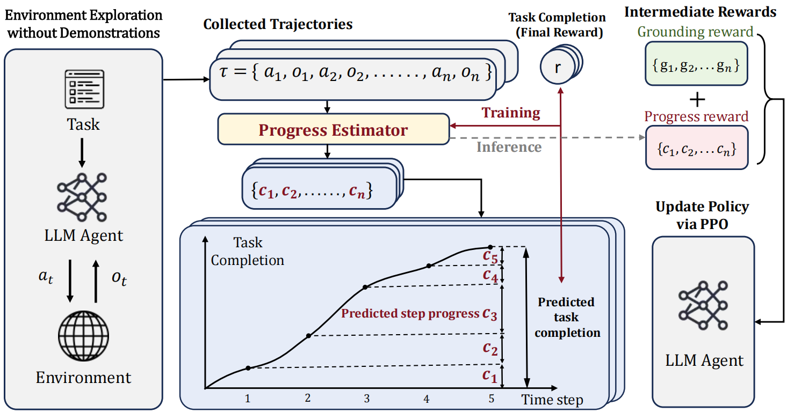

<h1 align="center">SPA-RL-Agent</h1>
<p align="center">
  <a href=""></a>
  &nbsp;
  <a href="https://github.com/WangHanLinHenry/SPA-RL-Agent"></a>
</p>

The repository contains the codes for our paper "[SPA-RL: Reinforcing LLM Agents via Stepwise Progress Attribution]()"

<p align="center">
  
</p>

This paper introduces **Stepwise Progress Attribution (SPA)**, a novel reward redistribution framework that provides fine-grained intermediate rewards by decomposing delayed rewards into incremental, per-step contributions, enabling more effective reinforcement learning for complex, multi-step agent tasks (Webshop, ALFWorld and VirtualHome).

### ✨Key advantages include:
1. **Fine-grained Reward Redistribution**: Effectively decomposes delayed rewards into intermediate rewards, reflecting incremental progress toward task completion.  
2. **Effective Multi-turn RL Training**: Utilizes these intermediate rewards in PPO, achieving outstanding performance on complex long-horizon tasks.


## 🎉News
- [2025.05.26] 🚀SPA-RL-Agent Repo launched!

## 📝Contents

- [Setup](#setup)
  - [Installation](#installation)
  - [Environment Setup](#environment-setup)
- [Usage](#method)
  - [Base Agent SFT Training](#base-agent-sft-training)
  - [Explored Trajectories Collection](#environment-exploration)
  - [Progress Estimator Training](#progress-estimator-training)
  - [Stepwise Progress Prediction](#step-rewards-annotation)
  - [RL Training](#rl-training)
  - [Evaluation](#evaluation)
- [Baselines](#baselines)
  - [GRPO](#grpo)
  - [RAGEN](#ragen)

### ⚙️ Setup
Due to library version incompatibilities, we set up two separate virtual environments:
- One for training the progress estimator
- Another for RL training and evaluation

Install Python Environment for progress estimator
```
```
Install Python Environment for RL training and evaluation
```
```

### ⛏️ Usage

#### Base Agent SFT Training

```
cd sft
# For ALFWorld environment
bash alfworld_llama3b.sh
# For Webshop environment
bash webshop_llama3b.sh
# For VirtualHome environment
bash virtualhome_llama3b.sh
```
⚠️ Note that the bash scripts provide the hyperparameters to reproduce our results. You should modify the settings, such as the model path, according to your own environment.

#### Explored Trajectories Collection

```
cd ..
# For ALFWorld environment
bash exploration/alfworld/my_generate_response.sh
# For WebShop environment
bash exploration/webshop/my_generate_response_webshop.sh
```

#### Progress Estimator Training

To 

#### Stepwise Progress Prediction

#### RL Training

#### Evaluation

### 💪 Baselines

## 🌹 Acknowledgement


## 🙏 Citation
If you find our work useful in your research please consider citing our paper:
```


```

